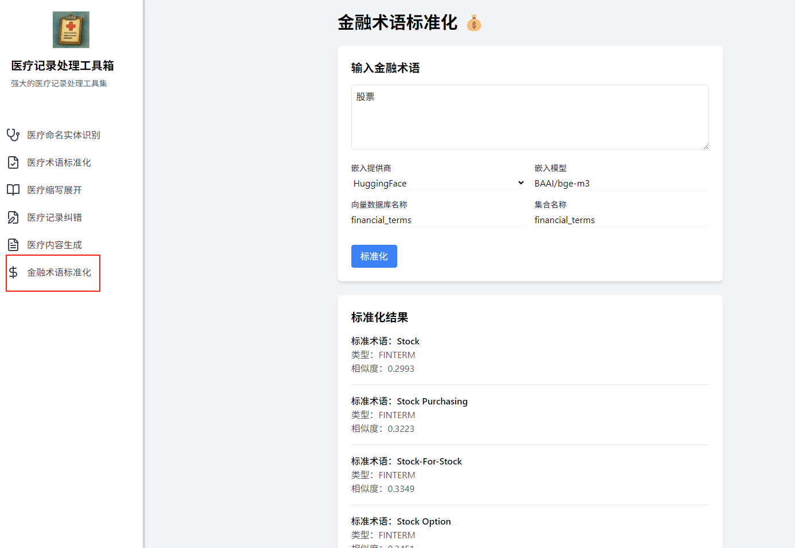

# 金融术语标准化功能开发与集成记录

## 0. 功能说明

本功能用于对输入的金融术语进行标准化处理。用户输入任意金融相关术语，系统会基于向量数据库（Milvus）和嵌入模型（如 BAAI/bge-m3）检索最相似的标准金融术语，并返回标准化结果，包括标准术语、类型、相似度等信息。适用于金融知识管理、智能问答、金融文本分析等场景。

## 1. 前端部分

### 1.1 侧边栏入口
- 文件：`src/components/Sidebar.js`
- 新增菜单项：
  - 名称：金融术语标准化
  - 图标：DollarSign
  - 路径：`/fin-std`

### 1.2 页面实现
- 文件：`src/pages/FinStdPage.js`
- 功能：
  - 输入金融术语
  - 嵌入模型选项（provider、model、dbName、collectionName）
  - 标准化按钮，调用后端接口
  - 结果展示（标准术语、类型、相似度）
  - 错误提示

### 1.3 路由配置
- 文件：`src/App.js`
- 新增路由：
  ```jsx
  <Route path="/fin-std" element={<FinStdPage />} />
  ```

### 1.4 前端代理配置
- 文件：`package.json`
- 新增字段：
  ```json
  "proxy": "http://localhost:8000",
  ```
- 作用：开发环境下前端 API 请求自动转发到后端 8000 端口

---

## 2. 后端部分

### 2.1 新增接口
- 文件：`backend/main.py`
- 新增 FastAPI 路由：
  ```python
  @app.post("/api/fin/std")
  async def financial_standardization(input: TextInput):
      ...
  ```
- 逻辑：调用 `FinStdService`，对输入术语进行向量标准化检索，返回标准化结果。
- 修正：去除 `FinStdService` 初始化时的 `db_path` 参数。

### 2.2 金融标准化服务类
- 文件：`backend/services/fin_std_service.py`
- 类：`FinStdService`
  - 参数：`provider`、`model`、`collection_name`
  - 连接 Milvus，执行向量检索

### 2.3 数据库准备
- 文件：`backend/tools/create_financial_db.py`
- 作用：批量导入金融术语数据，创建 Milvus 集合 `financial_terms`
- 优化：如集合已存在，先删除再创建，避免冗余

---

## 3. 其他调整
- 检查并统一了前后端接口路径、参数命名、依赖版本（如 langchain、pydantic 等）
- 解决了前端 404、500、CORS 等常见问题
- 完成了端到端联调与功能验证

---

## 4. 操作结果页面示例

如下图所示，用户输入"股票"后，系统返回了标准化结果列表，包括标准术语、类型、相似度等信息：



> 注：如需更新截图，请将最新页面截图保存为 `frontend/操作结果示例.png`。

---

**至此，金融术语标准化功能已集成并通过测试。**
如需二次开发或维护，请参考本文件内容。 